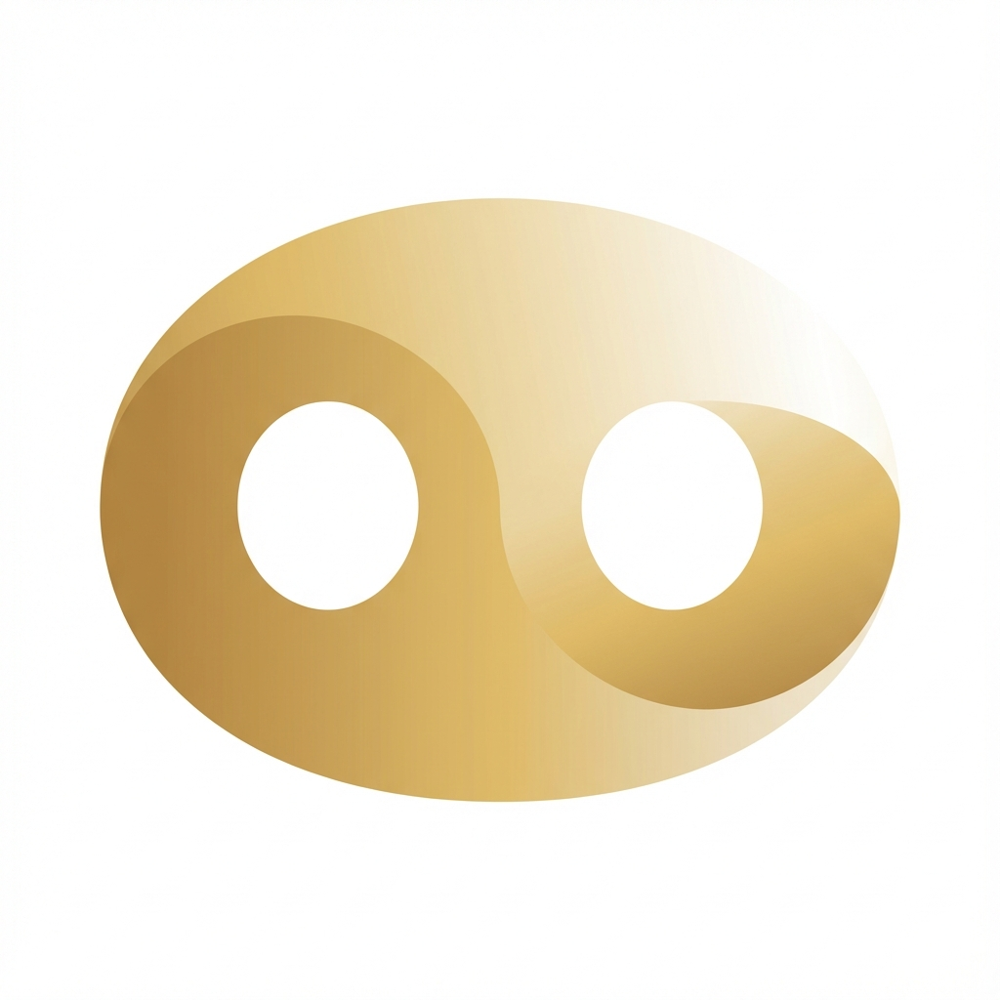

# 🐷 猪一家·温馨线上基地 (Piggy Family Hub)

<div align="center">
  
  <h3>欢迎回家！这里是猪猪家族的专属云小窝~ 🏠</h3>
</div>

---

## 👋 猪管有话说

咳咳，各位大猪小猪们好！👋 
我是你们勤劳又可爱的**猪管** (Pig Admin)。

这里是我们一家人的私密小天地。无论你在哪里，只要连上这个小窝，就能看到家里的照片、吐槽的生活琐事，还能随时随地查东西。本猪管已经把这里打扫得干干净净，换上了最漂亮的“阳光大屏”皮肤，保证让大家用得舒心！✨

如有问题，请随时呼叫猪管（虽然我不一定醒着 💤）。

---

## 🚀 怎样进入猪窝 (快速开始)

不用懂什么代码，跟着猪管这样做就行：

1. **打开大门** (启动)
   在终端里输入这行神咒：
   ```bash
   docker-compose up -d --build
   ```
   然后等待一小会儿，大概就是啃完一个苹果的时间 🍎。

2. **回家看看** (访问)
   打开浏览器，输入：
   [http://localhost:8080](http://localhost:8080)

3. **关门休息** (停止)
   如果想让小窝休息一下，就输入：
   ```bash
   docker-compose down
   ```

---

## 🔑 钥匙包 (账号密码)

为了安全，大家要拿好自己的钥匙哦！🔑

| 身份 | 用户名 | 默认密码 | 说明 |
| :--- | :--- | :--- | :--- |
| **👑 猪管大人** | `猪管` | `123456` | 只有猪管拥有至高无上的权限！(记得改密码哦) |
| **👨 爸比** | `爸比` | `123456` | 一家之主 (自称) |
| **👩 妈咪** | `妈咪` | `123456` | 真正的 BOSS |
| **👵 婆婆** | `婆婆` | `123456` | 慈祥的后勤部长 |
| **👋 客人猪猪** | `猪迷` | (无密码) | 点击登录页的“我是猪迷”直接进！ |

---

## ✨ 小窝有什么好玩的？

### 1. ☀️ 阳光仪表盘 (新!)
一进门就是暖洋洋的界面！
- **中央搜索框**：想问AI、找博客、还是搜百度/谷歌，一键搞定。
- **超大时钟**：时刻提醒你，该吃饭了！⏰

### 2. 📸 快乐相册 (`/gallery`)
记录我们的每一次旅行、每一顿大餐。支持图片和视频，没事就多翻翻~

### 3. 📝 碎碎念博客 (`/blog`)
家里的记事本。记下宝宝的成长、爸比的笑话、妈咪的食谱。

### 4. 🛠️ 实用工具
- **日历**：别忘了重要的纪念日！
- **购物清单**：谁喝完了最后一瓶牛奶？快记下来！
- **AI 助手**：智慧猪可以帮你解答问题，每次对话自动保存，可以随时查看历史！🤖

---

## 🧹 猪管维护手册 (高级)

*除了猪管，其他人请跳过这一段~* 🚫

- **数据备份**：所有照片和数据都藏在 `./data` 和 `./media` 文件夹里，千万别手滑删了！
- **修改配置**：只要动 `docker-compose.yml` 就行。
- **更新系统**：记得定期 `git pull` 拉取最新装修方案，然后重新运行启动神咒。

---

## 🗺️ 未来计划 (Roadmap)

猪管已经在筹划这些新功能了，敬请期待！

### v2.1 计划
- [ ] **提醒事项云同步** - 连接 Microsoft Outlook / Apple iCloud，自动同步日历和提醒
- [x] **多会话 AI 聊天** - ✅ 已完成！支持创建多个独立对话，方便查看历史

### v2.2+ 畅想
- [ ] **家庭日历视图** - 全家人的日程一目了然
- [ ] **通知推送** - 重要事项提醒到手机
- [ ] **深色模式** - 夜猫子专属

---

呼噜噜~ (Oink~) 祝大家玩得开心！💖

**—— 你们最爱的猪管 敬上**

